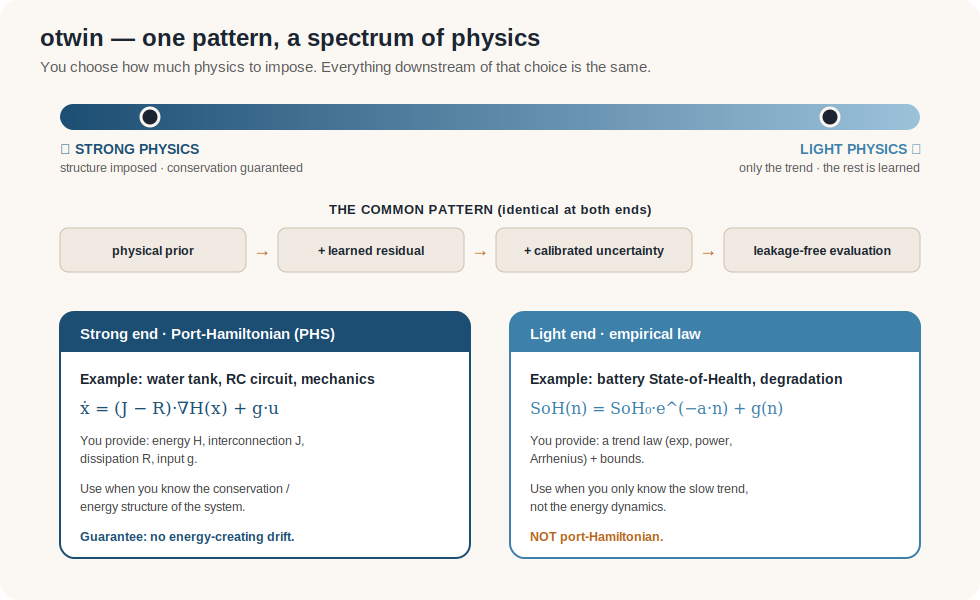
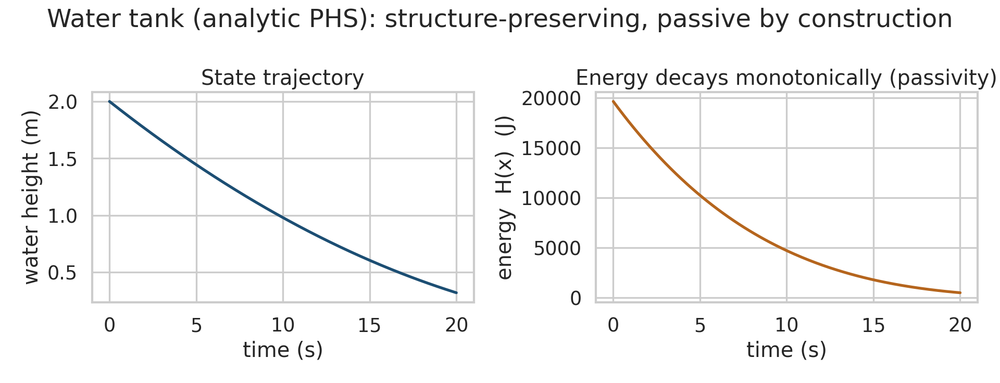
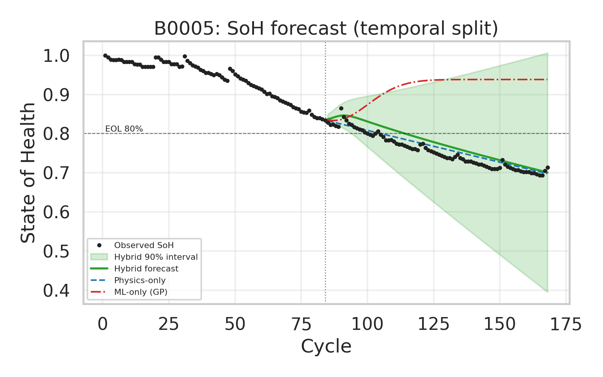
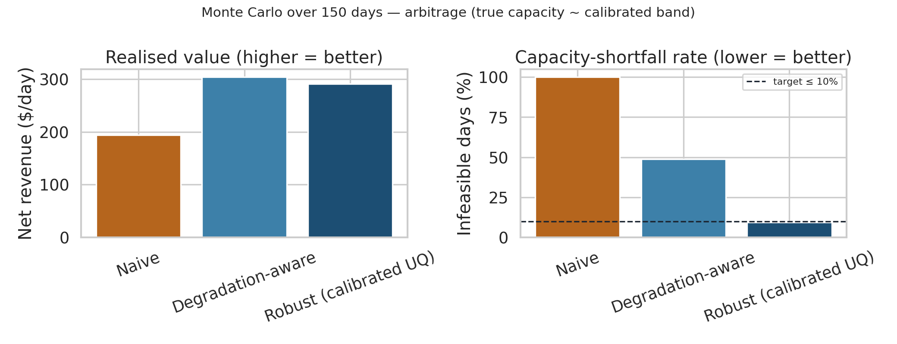

<div align="center">


# Physics-informed digital twins with calibrated uncertainty

Composable, physics-informed digital twins with calibrated uncertainty and leakage-free evaluation by default — lightweight, CPU-first.

[](https://github.com/Javihaus/otwin/actions)
[](https://www.python.org/downloads/)
[](https://opensource.org/licenses/MIT)
[](https://github.com/psf/black)
[](http://mypy-lang.org/)
[](https://github.com/astral-sh/ruff)
[](https://github.com/Javihaus/otwin)
[](https://github.com/Javihaus/otwin/stargazers)

</div>


## What is Otwin?

Otwin builds **digital twins** by pairing a *physical prior you trust* with a *learned correction*, then attaching **calibrated uncertainty** and grading itself only with leakage-free metrics. It is **one pattern**, applied across a spectrum — from full energy-conserving dynamics down to a slow degradation curve.

The physical prior can be used to forecasting far into the future or under new conditions — exactly where data-only models drift and break physical laws. Structure keeps those long-range forecasts physically valid; the calibrated interval says how much to trust them (a stated 90% interval is checked to really hold ~90% of the time).

---

## The mental model: a spectrum of physics

You decide **how much physics you impose**. Everything downstream of that choice is identical:

<div align="center">



</div>

**◀ Strong end — Port-Hamiltonian (PHS).** For systems with a known energy/conservation structure (mechanical, electrical, thermal, fluid). You supply the energy `H`, interconnection `J`, dissipation `R`, and input map `g`; conservation and passivity then hold **by construction**. This is the rigorous core.

**Light end — empirical law ▶.** For aging and degradation, where there is no energy dynamics — only a slow trend. You supply a transparent law (exponential, power, Arrhenius) plus bounds; a small learned residual corrects it.

**Which end do I use?**

| If you... | Use | Example |
|---|---|---|
| know the state-space and energy structure | **Strong (PHS)** | water tank, RC circuit, mass-spring |
| only know a slow degradation trend | **Light (empirical law)** | battery State-of-Health, fatigue |

> **Battery State-of-Health is the light end — it is _not_ port-Hamiltonian.** Capacity fade is a monotone degradation curve, not an energy-conserving system. Confusing the two is the most common conceptual error; otwin keeps them as two ends of one spectrum, not two unrelated tools.

> **Where this sits.** otwin models *observable-state, structure-known* dynamics — the white-box end of the broader family that also includes latent-state ML *world models*. Same substrate (state, conservation, dissipation, coupling); opposite ends of the observable↔latent axis.

---

## Installation

**Core (numpy + scipy only):**
```bash
# For now, until first release:
pip install git+https://github.com/Javihaus/otwin.git@v2
```

**With optional extras:**
```bash
pip install "otwin[torch]"  # For learned PHS (PortHamiltonianNN)
pip install "otwin[gp]"     # For GP-PHS (Gaussian Process uncertainty)
pip install "otwin[viz]"    # For matplotlib + plotly visualization
pip install "otwin[examples]" # Everything to run examples/ (cvxpy, pandas, sklearn, seaborn)
pip install "otwin[dev]"    # For testing/linting/typing/docs
```

**Requirements:**
- Python ≥ 3.10
- Runs on CPU (no GPU required)
- Works on a laptop

---

## Quick start

```python
import numpy as np
from otwin import DigitalTwin, evaluate
from otwin.systems import water_tank

# Strong end: an analytic port-Hamiltonian system from the catalog
twin = DigitalTwin(model=water_tank())

# Forecast from an initial state x0 over a time grid t with inputs u
x0 = np.array([1.0])
t  = np.linspace(0, 10, 100)
u  = np.zeros((100, 1))
fc = twin.forecast(x0, t, u)
print(fc["x"].shape)            # (100, 1)

# Evaluate with a leakage-free protocol + mandatory baselines
report = evaluate(twin, data, protocol="rolling_origin")
print(report)                   # skill score vs naive baseline, first
```

Calibrated uncertainty (ensembles / GP) and the full **light-end** pipeline
(empirical prior + bounded residual + conformal bands) are shown end-to-end in
[`examples/battery_soh`](examples/battery_soh).

---

## The strong end: Port-Hamiltonian systems

Traditional learned dynamics models (neural ODEs, LSTMs, generic regression) learn **unstructured** mappings. They work well in interpolation, but on **long horizons** or **out-of-distribution** inputs, they drift, violate conservation laws, and produce unphysical behavior.

**Port-Hamiltonian systems** enforce structure:

$$\dot{x} = \bigl(J(x) - R(x)\bigr)\,\nabla H(x) + g(x)\,u, \qquad y = g(x)^{\top}\,\nabla H(x)$$

where:

- $J(x) = -J(x)^{\top}$ (skew-symmetric $\rightarrow$ lossless interconnection)
- $R(x) \succeq 0$ (positive semidefinite $\rightarrow$ dissipation)
- $H(x)$ is the energy/storage function

**Power balance (provable by construction):**

$$\frac{dH}{dt} = -\,\nabla H^{\top} R\,\nabla H + y^{\top}u \;\leq\; y^{\top}u$$

With $u = 0$, energy is non-increasing. **No energy-creating drift, by algebra.**

When you learn a `PortHamiltonianNN`, the network architecture *enforces* `J` skew and `R` PSD regardless of weights. The guarantee is structural.

---

## The light end: empirical laws

When a system only degrades — capacity fade, wear, fatigue — there is no energy function to conserve. otwin uses a **transparent trend law** as the prior, learns a **bounded residual** on top, and quantifies uncertainty with **horizon-aware conformal intervals**:

$$\widehat{\mathrm{SoH}}(n) = \mathrm{SoH}_0\,e^{-a n} + g(n)$$

*(fade-law prior + learned residual)*

$$\bigl[\,\ell(n),\,u(n)\,\bigr] = \widehat{\mathrm{SoH}}(n) \pm z\,\sigma(n), \qquad \sigma(n) = s_0 + s_1\,(n - n_0)$$

*(band that widens with the horizon)*

Same four-step pattern as the strong end — only the prior is lighter. This is demonstrated end-to-end on the NASA battery fleet in [`examples/battery_soh`](examples/battery_soh) (State-of-Health and Remaining-Useful-Life forecasting). A reusable light-end primitive (`otwin.systems.degradation`) is on the roadmap; today the pattern lives in the worked example.

---

## What Can You Model?

Systems expressible as (irreversible) port-Hamiltonian / structured ODE state-space twins:
- **Mechanical systems** (mass-spring-damper, robotics, vehicles)
- **Electrical circuits** (RLC, power systems)
- **Thermal systems** (heat exchangers, buildings)
- **Chemical reactors** (CSTR with thermodynamics)
- **Fluid systems** (tanks, pipelines)
- **Coupled multi-physics systems** (via port composition)

**Not for:**
- High-dimensional pixel/video world models
- Systems without a clear state-space / energy structure
- Applications requiring a GPU-vendor stack (Omniverse, etc.)

---

## Features

### Core: Structure by Construction
- `PortHamiltonianSystem`: Analytic PHS (energy, interconnection, dissipation)
- `IrreversiblePHS`: Entropy production with σ ≥ 0 (second-law guarantee)
- `PortHamiltonianNN`: Learned dynamics with enforced structure (J skew, R PSD)
- Structure-preserving integrators: implicit-midpoint, discrete-gradient (optional)

### Uncertainty Quantification (Calibrated)
- Deep ensembles for `PortHamiltonianNN` (real variance, not a constant)
- GP-PHS (optional `[gp]`): Gaussian Process with structure-preserving kernel
- Calibration evaluation: PIT histograms, coverage curves, recalibration
- **UQ is evaluated for coverage, not assumed**

### Evaluation: Rigorous by Default
- **Temporal splits** (rolling-origin, holdout) — default for forecasting
- **Mandatory baselines** (persistence, drift, seasonal_naive)
- **Skill scores** (model error ÷ baseline error) as headline metric
- Metrics: RMSE, MAE, nRMSE, MASE, Theil_U, CRPS, PICP, MPIW
- R² is NOT a headline metric (use MASE/Theil_U for forecasting)
- Random splits opt-in with loud warning ("measures interpolation, not forecasting")

### Composability
- Port interconnection (connect twins via shared ports)
- Modular: swap analytic ↔ learned ↔ hybrid models
- Combine subsystems into multi-physics twins

### Engineering Quality
- **Fully typed** (`py.typed`, `mypy --strict` clean)
- **Gating CI** (tests/lint/type/coverage ≥ 85% all enforced, no swallowing)
- **CPU-first** (every example runs in seconds on a laptop)
- **Dependency discipline** (core = numpy + scipy; optional extras clearly separated)
- **Generated benchmarks** (all numbers reproducible, never hand-typed)

---

## Benchmarks

*Water-tank numbers are generated from `benchmarks/run_benchmarks.py` (rolling-origin, 5 folds). Battery numbers are produced by the worked example in [`examples/battery_soh`](examples/battery_soh) and read from its `results.csv`.*

### Example: Water Tank (analytic PHS, point forecast)

*Generated by `benchmarks/run_benchmarks.py` (rolling-origin, 5 folds, seed 42). Source: `benchmarks/results/water_tank.json`.*

| Model | RMSE | MASE | Theil's U |
|-------|------|------|---------|
| Persistence (baseline) | 0.0491 | 1.00 | 1.00 |
| **WaterTankModel (analytic PHS)** | **0.0031** | **0.13** | **0.054** |

- **Skill score:** 0.94 (94% better than persistence over the horizon).
- This benchmark is a **point** forecast (no UQ) → no CRPS/PICP here; calibrated intervals are shown in the battery example.

### Example: Battery State-of-Health (NASA fleet, light end)

*Empirical fade-law prior + bounded learned residual + conformal bands. Temporal split (fit on early cycles, forecast the remainder). Source of truth: [`examples/battery_soh`](examples/battery_soh) (`results.csv`, `figure_data/`).*

| Cell (24 °C) | Hybrid RMSE (SoH) | Theil's U | CRPS |
|---|---|---|---|
| B0005 | 0.031 | 0.35 | 0.030 |
| B0006 | 0.041 | 0.51 | 0.024 |
| B0007 | 0.013 | 0.19 | 0.021 |
| B0018 | 0.024 | 0.36 | 0.024 |

- **Theil's U < 1** on all four 24 °C cells → the hybrid beats persistence over the horizon.
- **Known limitation (reported as-is):** on the colder 4 °C cells (B0045–B0048) the hybrid does **not** yet beat persistence (Theil's U ≈ 1.1–1.8).
- **MASE caveat:** SoH is near-flat cycle-to-cycle, so the one-step MASE denominator → 0 and inflates MASE; Theil's U over the horizon is the meaningful skill metric here.

*All results: `benchmarks/results/*.json` (traceable to seed, data hash, split protocol)*

---

## Examples

See `examples/` for full runnable code.

### 1. Water Tank (analytic PHS)
Strong end: structure preservation (energy, dissipation) with a leakage-free benchmark. See [`examples/water_tank_phs`](examples/water_tank_phs).



### 2. Battery State-of-Health (light end: empirical law + residual)
NASA battery fleet: SoH / Remaining-Useful-Life forecasting with a fade-law prior, a bounded learned residual, and conformal intervals. **Not** port-Hamiltonian — the light end of the spectrum. See [`examples/battery_soh`](examples/battery_soh).



### 3. Grid-scale storage dispatch (predictive maintenance **and** real-time optimization)
The calibrated SoH twin feeds a receding-horizon (MPC) dispatch optimizer for peak shaving and energy arbitrage. Shows that **calibrated uncertainty** is what turns predictive maintenance into trustworthy real-time optimization: robust dispatch hits its 90% feasibility target at near-maximal value, while a naive plan over-promises every day. See [`examples/grid_storage_dispatch`](examples/grid_storage_dispatch).



*(Default figures use synthetic signals; drop in real EU data — OPSD/ENTSO-E — to regenerate.)*

*Planned:* irreversible-PHS reactor (CSTR with entropy production) and multi-physics port composition.

---

## Documentation

- **Getting started:** [GETTING_STARTED.md](GETTING_STARTED.md)
- **Worked examples:** [`examples/`](examples) — water tank (PHS), battery SoH (light end), grid-scale storage dispatch
- **Citations:** [CITATIONS.md](CITATIONS.md) (references with VERIFIED / UNVERIFIED status)
- **API docs (Sphinx):** source in [`docs/`](docs) — build with `make -C docs html`

---

## Status & Roadmap

**Current Status: Alpha (Development Status :: 3)**

Maturity:
- ✅ Core structural properties: tested and provable
- ✅ Benchmarks: generated and reproducible
- ⚠️ API stability: evolving (breaking changes possible before 1.0)
- ⚠️ Coverage: 85%+ gated, but not exhaustive

**Roadmap to Beta:**
- API stabilization (deprecation policy)
- Extended test coverage (90%+)
- More reference examples (mechanical, thermal, multi-physics)
- Documentation polish

**Roadmap to Stable:**
- Significant real-world validation
- Production deployments with monitoring
- Formal benchmarking suite

We'll never claim "Production/Stable" until we've earned it.

---

## Contributing

Contributions welcome! See [CONTRIBUTING.md](CONTRIBUTING.md).

**Development setup:**
```bash
git clone https://github.com/Javihaus/otwin.git
cd otwin
python -m venv venv
source venv/bin/activate  # Windows: venv\Scripts\activate
pip install -e ".[dev]"
pytest  # All tests should pass
```

**Standards:**
- `mypy --strict` compliance
- `ruff` + `black` formatting
- ≥ 85% coverage on core modules
- Property-based tests for structural guarantees
- No swallowed failures in CI

---

## Citation

If you use otwin in research, please cite:

```bibtex
@software{otwin,
  title = {otwin: Physics-informed digital twins with calibrated uncertainty},
  author = {Marin, Javier},
  year = {2025},
  version = {2.0.0-alpha},
  url = {https://github.com/Javihaus/otwin}
}
```

See [CITATIONS.md](CITATIONS.md) for all scientific references (status: VERIFIED / UNVERIFIED).

---

## License

MIT License. See [LICENSE](LICENSE).

---

## Acknowledgments

This v2 rebuild grew from a [Towards Data Science tutorial](https://towardsdatascience.com/) on hybrid digital twins (v1) that gained traction. v2 is a complete rewrite prioritizing **scientific rigor** and **leakage-free evaluation**. See [legacy_v1/README.md](legacy_v1/README.md) for the migration notes.

The v1 tutorial code is preserved in `legacy_v1/` for continuity and educational value.
