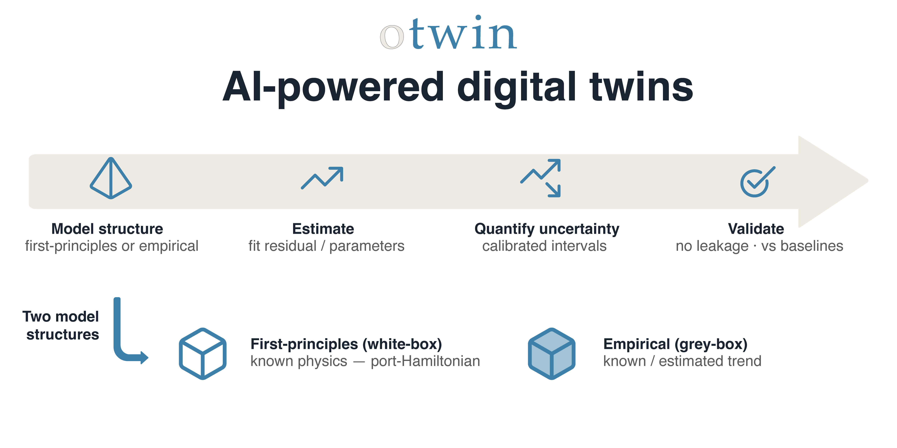
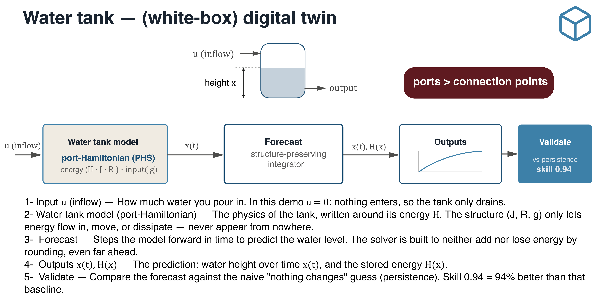
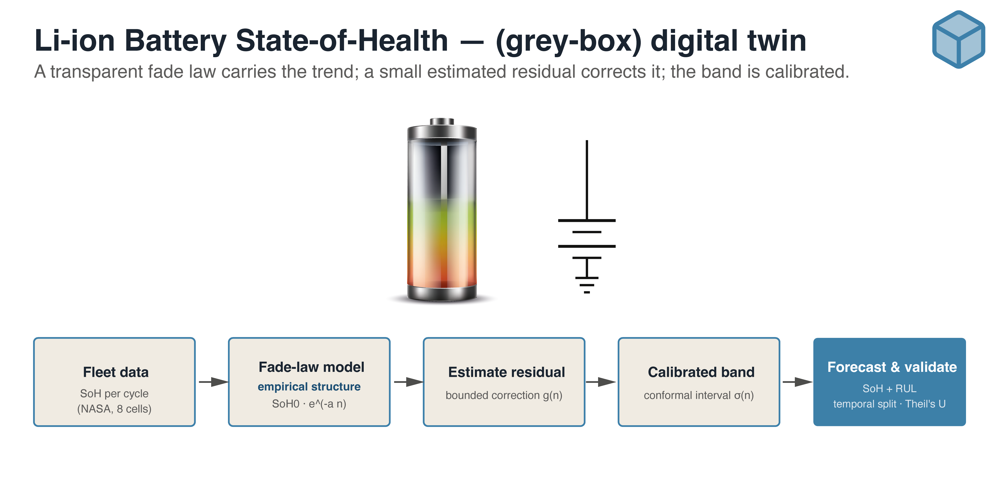
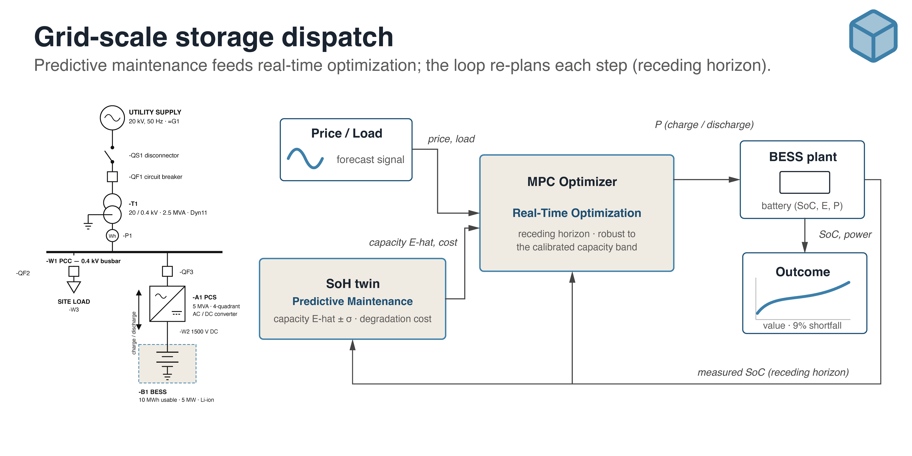

<div align="center">
<br>

<br>
<br>

# AI-powered Digital Twins with Calibrated Uncertainty

Composable, physics-informed digital twins with calibrated uncertainty and leakage-free validation by default — lightweight, CPU-first.

[](https://github.com/Javihaus/otwin/actions)
[](https://www.python.org/downloads/)
[](https://opensource.org/licenses/MIT)
[](https://github.com/psf/black)
[](http://mypy-lang.org/)
[](https://github.com/astral-sh/ruff)
[](https://github.com/Javihaus/otwin)
[](https://github.com/Javihaus/otwin/stargazers)

</div>

---

## Overview

Otwin builds **AI-powered digital twins** that stay **physics-informed**: you bring the physical *model structure* you trust, otwin **estimates** the rest from data, attaches **calibrated uncertainty**, and **validates** without leakage — CPU-first.

Engineers know three modelling options:

- **White-box** — the whole model comes from first principles; every equation and parameter is known.
- **Grey-box** — you fix the *structure* from physics and **estimate** the unknown parts from data.
- **Black-box** — data decides everything (neural networks, generic ML).

otwin works on the **physics-informed side — from white-box to grey-box**. The black-box end is where latent-state *world models* live; otwin is their **observable-state, physics-grounded counterpart** — the digital-twins ∩ world-models intersection it targets.

Why structure matters: black-box models are accurate at *interpolation* — predicting inside the range of data they have seen — but pushed **beyond that data** (long horizons, or operating conditions never seen in training) they drift and break physical laws. The physical structure keeps long-range forecasts physically valid; the calibrated interval says how much to trust each one — a stated 90% interval is checked to really hold ~90% of the time.

---

## Modeling approach: from white-box to grey-box

You choose **how much first-principles structure you can write down**. Everything after that choice is the same workflow.

<div align="center">



<sub>otwin builds grey-box digital twins: choose a model structure (first-principles or empirical), then one workflow — estimate, quantify uncertainty, validate.</sub>

</div>

| If you can... | Model structure | Example |
|---|---|---|
| write the system's dynamics from physics | **First-principles (port-Hamiltonian)** | water tank, RC circuit, mass-spring |
| only state a coarse trend it follows | **Empirical law + estimated residual** | battery State-of-Health, fatigue |

> The first-principles models describe a system as components that **exchange energy through ports** — so conservation and passivity hold by construction, not by hope. **Battery State-of-Health sits at the empirical end: a degradation curve, _not_ an energy-conserving system.** Confusing the two is the most common conceptual error.

> **What otwin is not.** otwin models *observable-state, structure-known* dynamics — the white/grey-box side. The black-box side (latent-state ML *world models*) learns dynamics with no imposed physics. Same substrate (state, conservation, dissipation, coupling); opposite ends of the white-box ↔ black-box axis.

---

## The Otwin workflow

One workflow, whether your model structure is first-principles or empirical — **estimate → validate → forecast**:

1.  **Choose a model structure** — a first-principles (port-Hamiltonian) model, or an empirical law.
2. **Estimate** it from data — unknown parameters and a bounded residual.
3. **Quantify uncertainty** — calibrated, horizon-aware intervals.
4. **Validate** without leakage — temporal / rolling-origin split against mandatory baselines.

---

## Installation

**Core (numpy + scipy only):**
```bash
# For now, until first release:
pip install git+https://github.com/Javihaus/otwin.git@v2
```

**With optional extras:**
```bash
pip install "otwin[torch]"    # Learned first-principles model (PortHamiltonianNN)
pip install "otwin[gp]"       # GP-PHS (Gaussian-process uncertainty)
pip install "otwin[viz]"      # matplotlib + seaborn + plotly visualization
pip install "otwin[examples]" # Everything to run examples/ (cvxpy, pandas, sklearn, seaborn)
pip install "otwin[dev]"      # Testing / linting / typing / docs
```

**Requirements:**
- Python ≥ 3.10
- Runs on CPU (no GPU required)
- Works on a laptop

---

## Get started

```python
import numpy as np
from otwin import DigitalTwin, evaluate
from otwin.systems import water_tank   # a ready-made first-principles model

# ── First-principles catalog ──────────────────────────────────────────────
# Available now:
#   water_tank          fluid system (draining tank)
#   mass_spring_damper  mechanical oscillator
# Build your own from energy H, interconnection J, dissipation R, input g:
#   from otwin.systems import PortHamiltonianSystem   # conservative/dissipative system
#   from otwin.systems import IrreversiblePHS         # adds entropy production
#
# Roadmap (named structures, not yet importable):
#   rc_circuit      electrical RLC          heat_exchanger  thermal mass
#   reactor         chemical reactor (CSTR) degradation     empirical fade law
# ──────────────────────────────────────────────────────────────────────────

# 1. Choose a model structure: a first-principles (port-Hamiltonian) system
twin = DigitalTwin(model=water_tank())

# 2. Forecast from an initial state x0 over a time grid t with inputs u
x0 = np.array([1.0])
t  = np.linspace(0, 10, 100)
u  = np.zeros((100, 1))
fc = twin.forecast(x0, t, u)
print(fc["x"].shape)            # (100, 1)

# 3. Validate with a leakage-free protocol + mandatory baselines
report = evaluate(twin, data, protocol="rolling_origin")
print(report)                   # skill score vs naive baseline, first
```

Calibrated uncertainty (ensembles / GP) and the full **empirical-law** workflow
(empirical prior + estimated residual + conformal bands) are shown end-to-end in
[`examples/battery_soh`](examples/battery_soh).

---

## First-principles models: port-Hamiltonian

Black-box models (neural ODEs, LSTMs, generic regression) learn **unstructured** mappings. They interpolate well, but on **long horizons** or **unseen operating conditions** they drift, violate conservation laws, and produce unphysical behavior.

A **port-Hamiltonian** model fixes the structure. The system is described as components that exchange energy through ports:

$$\dot{x} = \bigl(J(x) - R(x)\bigr)\,\nabla H(x) + g(x)\,u, \qquad y = g(x)^{\top}\,\nabla H(x)$$

where:

- $J(x) = -J(x)^{\top}$ (skew-symmetric $\rightarrow$ lossless interconnection)
- $R(x) \succeq 0$ (positive semidefinite $\rightarrow$ dissipation)
- $H(x)$ is the energy / storage function

**Power balance (provable by construction):**

$$\frac{dH}{dt} = -\,\nabla H^{\top} R\,\nabla H + y^{\top}u \;\leq\; y^{\top}u$$

With $u = 0$, energy is non-increasing. **No energy-creating drift, by algebra.**

When you **estimate** a `PortHamiltonianNN` from data, the network architecture *enforces* `J` skew and `R` PSD regardless of weights. The guarantee is structural — this is the white-box end of grey-box.

---

## Empirical-law models: degradation

When a system only degrades — capacity fade, wear, fatigue — there is no energy function to conserve. otwin uses a **transparent trend law** as the model structure, **estimates** a **bounded residual** on top, and quantifies uncertainty with **horizon-aware conformal intervals**:

$$\widehat{\mathrm{SoH}}(n) = \mathrm{SoH}_0\,e^{-a n} + g(n)$$

*(empirical fade-law prior + estimated residual)*

$$\bigl[\,\ell(n),\,u(n)\,\bigr] = \widehat{\mathrm{SoH}}(n) \pm z\,\sigma(n), \qquad \sigma(n) = s_0 + s_1\,(n - n_0)$$

*(band that widens with the forecast horizon)*

Same workflow as the first-principles end — only the model structure is lighter (grey-box leaning empirical). This is demonstrated end-to-end on the NASA battery fleet in [`examples/battery_soh`](examples/battery_soh) (State-of-Health and Remaining-Useful-Life forecasting). A reusable empirical-law primitive (`otwin.systems.degradation`) is on the roadmap; today the structure lives in the worked example.

---

## What you can model

First-principles (port-Hamiltonian / structured state-space) models:

- **Mechanical systems** (mass-spring-damper, robotics, vehicles)
- **Electrical circuits** (RLC, power systems)
- **Thermal systems** (heat exchangers, buildings)
- **Chemical reactors** (CSTR with thermodynamics, via irreversible PHS)
- **Fluid systems** (tanks, pipelines)
- **Coupled multi-physics systems** (via port composition)

Empirical-law models: aging and degradation (battery State-of-Health, fatigue, wear, corrosion).

**Out of scope (this is the black-box end):**
- High-dimensional pixel / video world models
- Systems with no usable state-space or trend structure
- Workflows requiring a GPU-vendor stack (Omniverse, etc.)

---

## Key features

### First-principles core (white-box structure)
- `PortHamiltonianSystem`: analytic PHS (energy, interconnection, dissipation)
- `IrreversiblePHS`: entropy production with σ ≥ 0 (second-law guarantee)
- `PortHamiltonianNN`: learned dynamics with enforced structure (J skew, R PSD)
- Structure-preserving integrators: implicit-midpoint, discrete-gradient (optional)

### Calibrated uncertainty
- Deep ensembles for `PortHamiltonianNN` (real variance, not a constant)
- GP-PHS (optional `[gp]`): Gaussian process with a structure-preserving kernel
- Calibration diagnostics: PIT histograms, coverage curves, recalibration
- **Uncertainty is validated for coverage, not assumed**

### Leakage-free validation (by default)
- **Temporal splits** (rolling-origin, holdout) — the default for forecasting
- **Mandatory baselines** (persistence, drift, seasonal-naive)
- **Skill score** (model error ÷ baseline error) as the headline metric
- Metrics: RMSE, MAE, nRMSE, MASE, Theil's U, CRPS, PICP, MPIW
- R² is not a headline metric (use MASE / Theil's U for forecasting)
- Random splits are opt-in with a loud warning ("measures interpolation, not forecasting")

### Composability (physical networks)
- Port interconnection (connect twins through shared ports)
- Modular: swap analytic ↔ learned ↔ hybrid model structures
- Combine subsystems into multi-physics twins

### Engineering quality
- **Fully typed** (`py.typed`, `mypy --strict` clean)
- **Gating CI** (tests / lint / type / coverage ≥ 85% all enforced, no swallowing)
- **CPU-first** (every example runs in seconds on a laptop)
- **Dependency discipline** (core = numpy + scipy; optional extras clearly separated)
- **Generated benchmarks** (every number reproducible, never hand-typed)

---

## Examples

See `examples/` for full runnable code.

### 1. Water tank (first-principles, port-Hamiltonian)
White-box structure preservation (energy, dissipation) with leakage-free validation. See [`examples/water_tank_phs`](examples/water_tank_phs).

<div align="center">
  


</div>
  
<sub>A first-principles (white-box) twin: the structure-preserving forecast keeps energy physical; validated against a persistence baseline.</sub>

### 2. Battery State-of-Health (empirical-law model)
NASA battery fleet: SoH / Remaining-Useful-Life forecasting with an empirical fade-law structure, an estimated bounded residual, and conformal intervals. **Not** port-Hamiltonian — the empirical end of grey-box. See [`examples/battery_soh`](examples/battery_soh).

<div align="center">



</div>

<sub>An empirical (grey-box) twin: a transparent fade law + an estimated residual + a calibrated band; validated against baselines.</sub>

### 3. Grid-scale storage dispatch (predictive maintenance **and** real-time optimization)
The calibrated SoH model feeds a receding-horizon (MPC) dispatch optimizer for peak shaving and energy arbitrage. Shows that **calibrated uncertainty** is what turns predictive maintenance into trustworthy real-time optimization: the robust plan hits its 90% feasibility target at near-maximal value, while a naive plan over-promises every day. See [`examples/grid_storage_dispatch`](examples/grid_storage_dispatch).

<div align="center">



</div>

<sub>Predictive maintenance feeds real-time optimization — the calibrated SoH twin makes the dispatch trustworthy (re-planned each step).</sub>

*Planned:* irreversible-PHS reactor (CSTR with entropy production) and multi-physics port composition.

---

## Documentation

- **Get started:** [GETTING_STARTED.md](GETTING_STARTED.md)
- **Examples:** [`examples/`](examples) — water tank (first-principles), battery SoH (empirical), grid-scale storage dispatch
- **Citations:** [CITATIONS.md](CITATIONS.md) (references with VERIFIED / UNVERIFIED status)
- **API docs (Sphinx):** source in [`docs/`](docs) — build with `make -C docs html`

---

## Status & roadmap

**Current status: Alpha (Development Status :: 3)**

**Roadmap to beta:**
- API stabilization (deprecation policy)
- Extended test coverage (90%+)
- More reference examples (mechanical, thermal, multi-physics)
- A reusable empirical-law (`degradation`) model structure
- Documentation polish

**Roadmap to stable:**
- Significant real-world validation
- Production deployments with calibration monitoring
- Formal benchmarking suite (comparison against other libraries)

We will not claim "Production / Stable" until we have earned it.

---

## Contributing

Contributions welcome. See [CONTRIBUTING.md](CONTRIBUTING.md).

**Development setup:**
```bash
git clone https://github.com/Javihaus/otwin.git
cd otwin
python -m venv venv
source venv/bin/activate  # Windows: venv\Scripts\activate
pip install -e ".[dev]"
pytest
```

**Standards:**
- `mypy --strict` compliance
- `ruff` + `black` formatting
- ≥ 85% coverage on core modules
- Property-based tests for structural guarantees
- No swallowed failures in CI

---

## Citation

If you use otwin in research, please cite:

```bibtex
@software{otwin,
  title = {otwin: Physics-informed digital twins with calibrated uncertainty},
  author = {Marin, Javier},
  year = {2025},
  version = {2.0.0-alpha},
  url = {https://github.com/Javihaus/otwin}
}
```

See [CITATIONS.md](CITATIONS.md) for all scientific references (status: VERIFIED / UNVERIFIED).

---

## License

MIT License. See [LICENSE](LICENSE).

---

## Acknowledgments

This v2 rebuild grew from a [Towards Data Science tutorial](https://towardsdatascience.com/) on hybrid digital twins (v1) that gained traction. v2 is a complete rewrite prioritizing **scientific rigor** and **leakage-free validation**. See [legacy_v1/README.md](legacy_v1/README.md) for the migration notes.

The v1 tutorial code is preserved in `legacy_v1/` for continuity and educational value.
