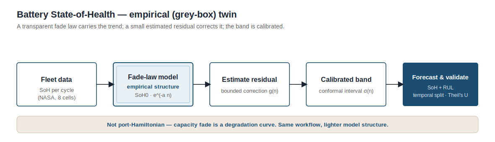
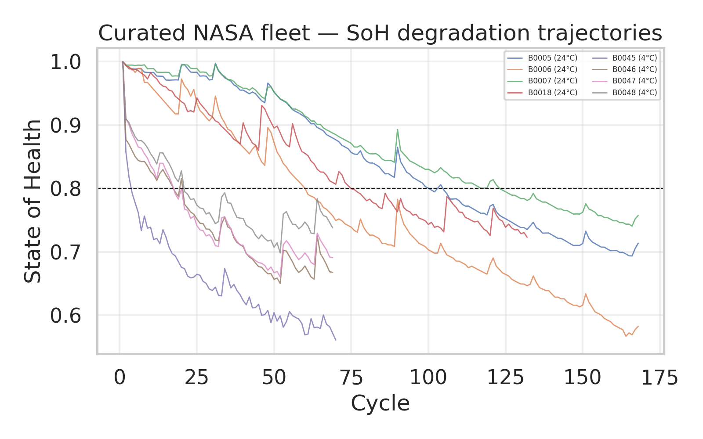
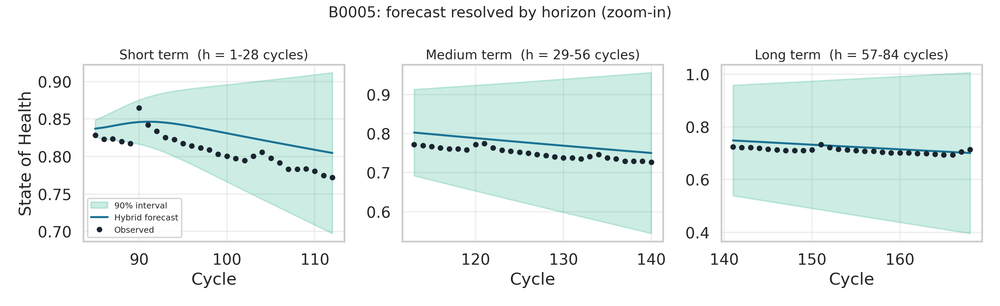
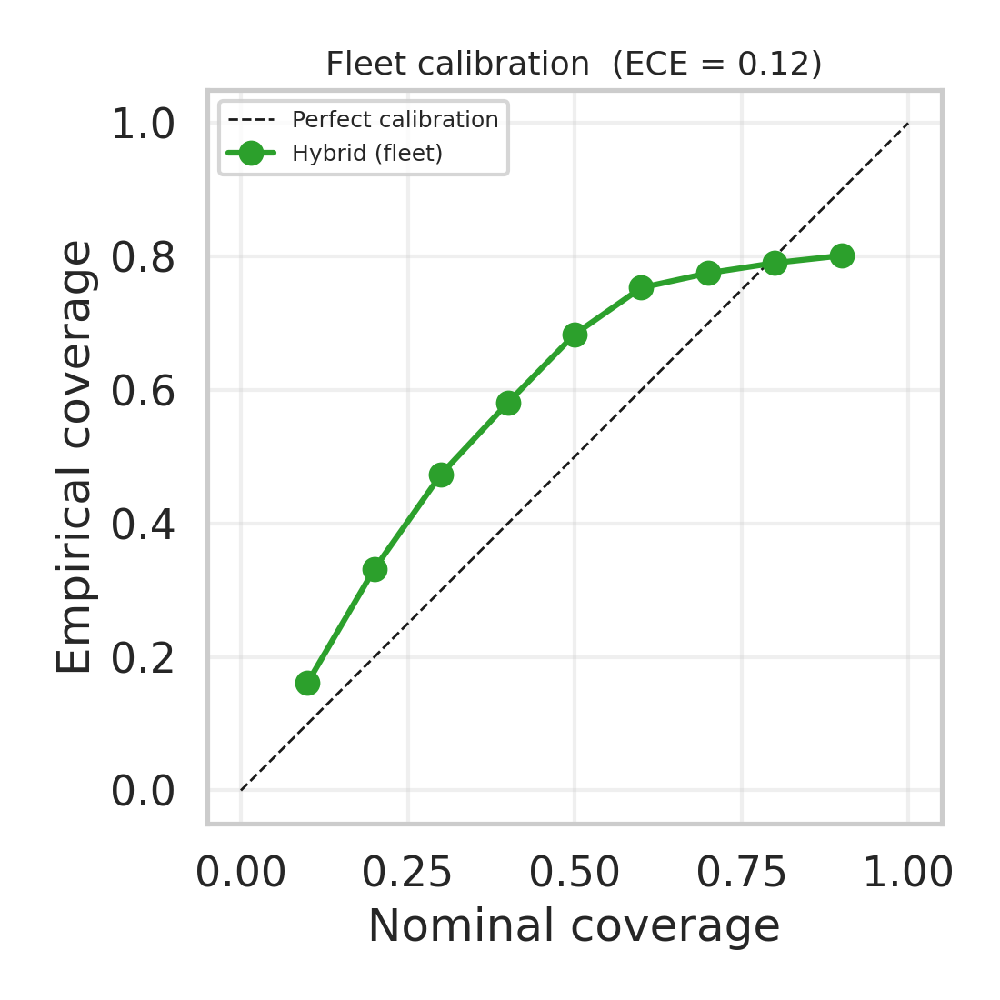
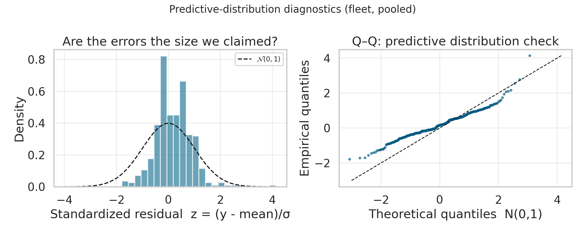
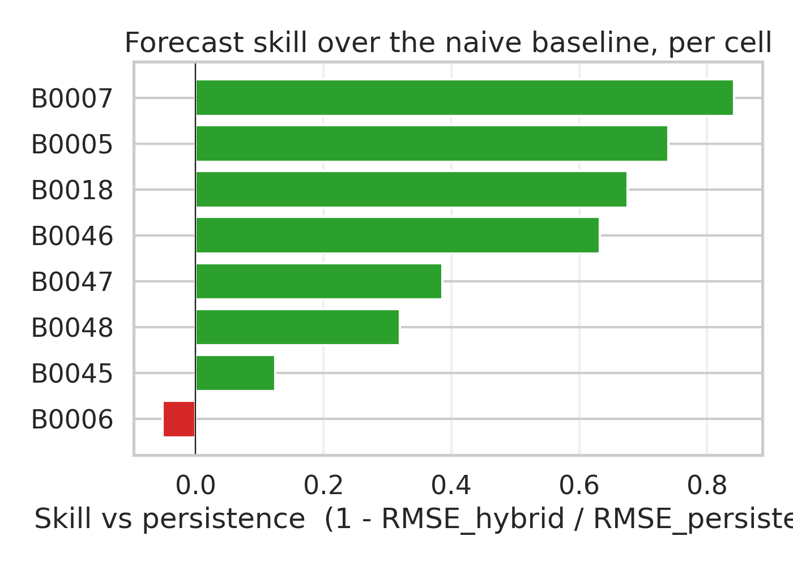
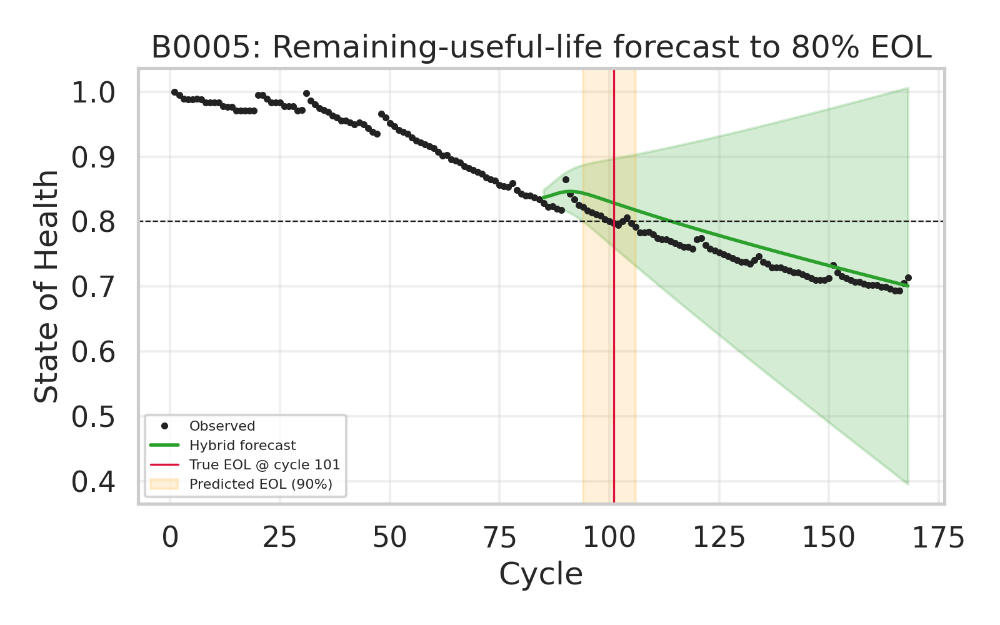

# Battery State-of-Health — empirical-law model (grey-box)



Forecasting lithium-ion **State-of-Health (SoH)** and **Remaining-Useful-Life
(RUL)** on the NASA battery-aging dataset. This is the **empirical end** of otwin (grey-box):
there is no energy dynamics to conserve, only a slow degradation trend, so a
mechanistic **fade-law prior** carries the trend, a **bounded learned residual**
corrects it, and **horizon-aware conformal intervals** quantify uncertainty.

The fade law is not a curve-fit of convenience. It is the constant-temperature,
constant-current specialisation of the Wang et al. (2011) semi-empirical model
`Q_loss = B·exp(−Ea/RT)·(Ah)^z`: at a single ambient temperature the Arrhenius
factor folds into the prefactor, and at constant current the charge throughput
`Ah ∝ n` (cycle number), leaving

```
SoH(n) = 1 − c · n^z ,   c ≥ 0,  z ∈ [0.5, 1.0]
```

where the throughput exponent `z` is mechanistically informative: **z ≈ 0.5** is
diffusion-limited SEI growth (a solvent-diffusion-limited interphase film thickens
with the square root of throughput — the self-limiting square-root law), and
**z ≈ 1** is linear throughput wear (active-material loss). On the fleet the fitted
exponent separates the regimes: the heavily-cycled 24 °C cells land at z ≈ 1.0
(linear wear), the 4 °C cells at z ≈ 0.5 (diffusion-limited SEI).

> Not port-Hamiltonian — capacity fade is a monotone degradation curve. Same
> workflow as the first-principles end (prior → residual → calibrated uncertainty
> → leakage-free evaluation), only the physics is lighter.

## Why grey-box and not white-box here (methodology)

The water-tank and DC-motor examples are **white-box**: you write the dynamics from
first principles with known parameters and validate against a *closed-form* answer
(the analytic steady state, exact passivity). A battery has no equivalent for
State-of-Health, and the reason is worth stating precisely, because it is what
decides the modeling approach:

- **Two timescales.** The *fast* intra-cycle electrochemistry (charge/discharge,
  voltage, SoC) does have first-principles models — porous-electrode theory
  (Newman), single-particle / DFN, which are genuinely white/grey-box and, in
  otwin's language, irreversible port-Hamiltonian systems with entropy production.
  SoH is the *slow* inter-cycle envelope over hundreds of cycles; it is governed by
  coupled degradation mechanisms (SEI growth, lithium plating, active-material
  loss) whose rate constants are cell- and chemistry-specific and must be estimated
  from data. The physics gives the *form*, not the parameters.
- **No closed-form ground truth.** There is no analytic SoH trajectory to validate
  against — validation is necessarily empirical (held-out future cycles), so even
  the most mechanistic SoH model is grey-box by construction.
- **Identifiability limits what physics we can honestly include.** The NASA cells
  used here are aged at a *single* ambient temperature, so the Arrhenius activation
  energy `Ea` is **not identifiable** (it is confounded with the prefactor) — adding
  a temperature term would be unfalsifiable decoration, so we don't. Likewise, a
  separate `a·√n + b·n` split is too collinear over one cell's cycle range to
  identify, so we fit the single exponent `z` (well-determined by the curve's
  shape) instead. A true white-box-vs-grey-box battery comparison would need a
  dataset spanning several temperatures, which this one is not.

The takeaway, and the point for a digital-twin practitioner: **the modeling
approach is dictated by the physics you can write down *and* the parameters the
data can identify — not by preference.** That is exactly the white-box ↔ grey-box
↔ black-box judgement otwin is built around.

## The fleet

Eight curated NASA cells: **B0005/6/7/18** (24 °C) and **B0045–48** (4 °C). The
two temperatures are different operating regimes — used here to stress-test the
method across conditions.



## Forecast with calibrated uncertainty

Train on the early cycles, forecast the rest. The hybrid forecast (fade-law prior
+ residual) with its conformal band:


Resolved by horizon (short / medium / long term):



## Does the uncertainty mean what it says?

A stated 90% interval should contain the truth ~90% of the time. Calibration
diagnostics (coverage curve and standardized-residual / Q–Q checks):





## Skill vs baselines (no fooling yourself)

Every metric is reported against naive baselines (persistence, drift) under a
temporal split:



## Remaining Useful Life



## Results (real, from `results.csv`)

On the **24 °C** cells the hybrid beats persistence over the forecast horizon
(Theil's U < 1): B0007 ≈ 0.16, B0005 ≈ 0.26, B0018 ≈ 0.32. On the **4 °C** cells —
which are diffusion-limited (fitted z ≈ 0.5), exactly where the square-root SEI
prior fits best — the hybrid now beats persistence on **all four**: B0046 ≈ 0.37,
B0047 ≈ 0.61, B0048 ≈ 0.68, B0045 ≈ 0.88. Hybrid SoH RMSE ≈ 0.010–0.084 across the
fleet.

**Known limitation (reported as-is):** one 24 °C cell, B0006, is the single case
where the hybrid does *not* beat persistence (Theil's U ≈ 1.05, marginal). The
cell that misses is shown, not hidden.

Per-figure data is in `figure_data/*.csv`; the full per-cell table is `results.csv`.

## Run

```bash
pip install numpy scipy scikit-learn pandas matplotlib seaborn
python run_battery_soh.py
```

The raw NASA data is not committed (large). Place the Kaggle NASA battery archive
in the project as `archive.zip` (or `data/nasa/`) before running; the loader
aggregates per-cycle SoH from it. Figures regenerate into `figures/`.
