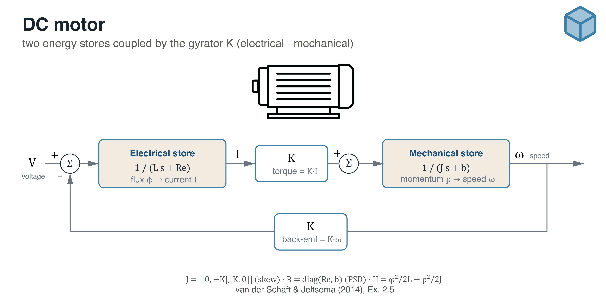
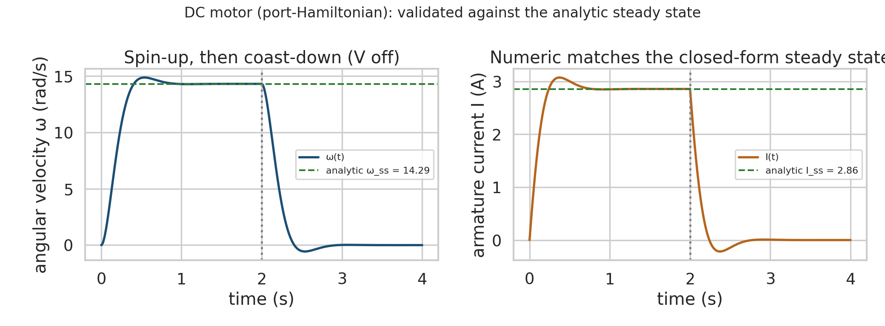
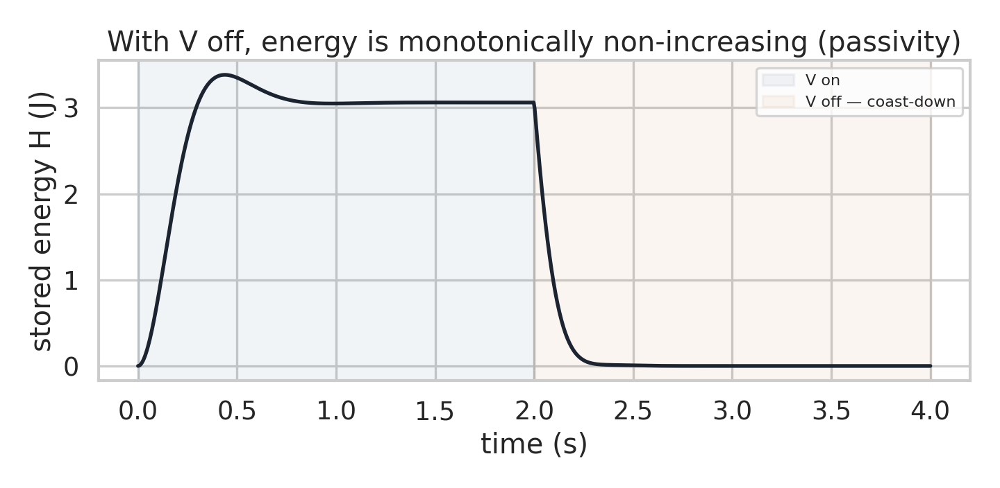

# DC motor — first-principles model (multi-domain port-Hamiltonian)



A **multi-domain** first-principles example: a DC motor written as an analytic
port-Hamiltonian system with two energy stores — one electrical (the inductor
flux-linkage `φ`) and one mechanical (the rotor angular momentum `p`) — coupled by
the gyrator constant `K`. It shows two properties that make a first-principles model
worthwhile: it reproduces the **exact closed-form steady state** without any fitting,
and it is **passive by construction** — with the voltage removed, the stored energy
is monotonically non-increasing.

State `x = [φ, p]`, input `u = [V]` (voltage), output `y = I = φ/L` (current),
energy `H = φ²/(2L) + p²/(2J)`.

```
[φ̇]   ( [ 0  −K ]   [Re  0 ] ) [φ/L]   [1]
[ṗ]  = ( [ K   0 ] − [ 0  b ] ) [ p/J ] + [0] V
```



Spin-up under a constant voltage, then coast-down once the voltage is cut. The
numeric angular velocity and current converge to the analytic steady state
(dashed) — the model is validated against a closed form, not a fit.



With the voltage off, the stored energy decays monotonically — the
structure-preserving integrator respects the energy balance
`dH/dt = −∇Hᵀ R ∇H + yᵀu ≤ yᵀu`.

## What it demonstrates

- **Port-Hamiltonian structure across two physical domains** — `J = [[0, −K], [K, 0]]`
  skew-symmetric (the gyrator), `R = diag(Re, b)` positive semidefinite (armature
  resistance and viscous friction).
- **Validation against a closed form** — under a constant voltage the motor must
  reach `ω_ss = VK/(Re·b + K²)` and `I_ss = Vb/(Re·b + K²)`. The numeric steady
  state matches both to within 0.001%.
- **Passivity / no energy-creating drift** — with `V = 0` the energy is
  monotonically non-increasing (verified numerically).
- **Power-balance identity** `dH/dt = dissipated + supplied` holds at sample points
  (max residual ≈ 1e-15).

## Reference

van der Schaft, A. & Jeltsema, D. (2014). *Port-Hamiltonian Systems Theory: An
Introductory Overview.* Foundations and Trends in Systems and Control, 1(2–3),
173–378. Example 2.5, Eq. (2.30).

## Run

```bash
pip install numpy scipy matplotlib seaborn
python run_dc_motor.py
```

Runs in under a second on CPU. Figures are written to `figures/`, the underlying
series to `figure_data/`.
