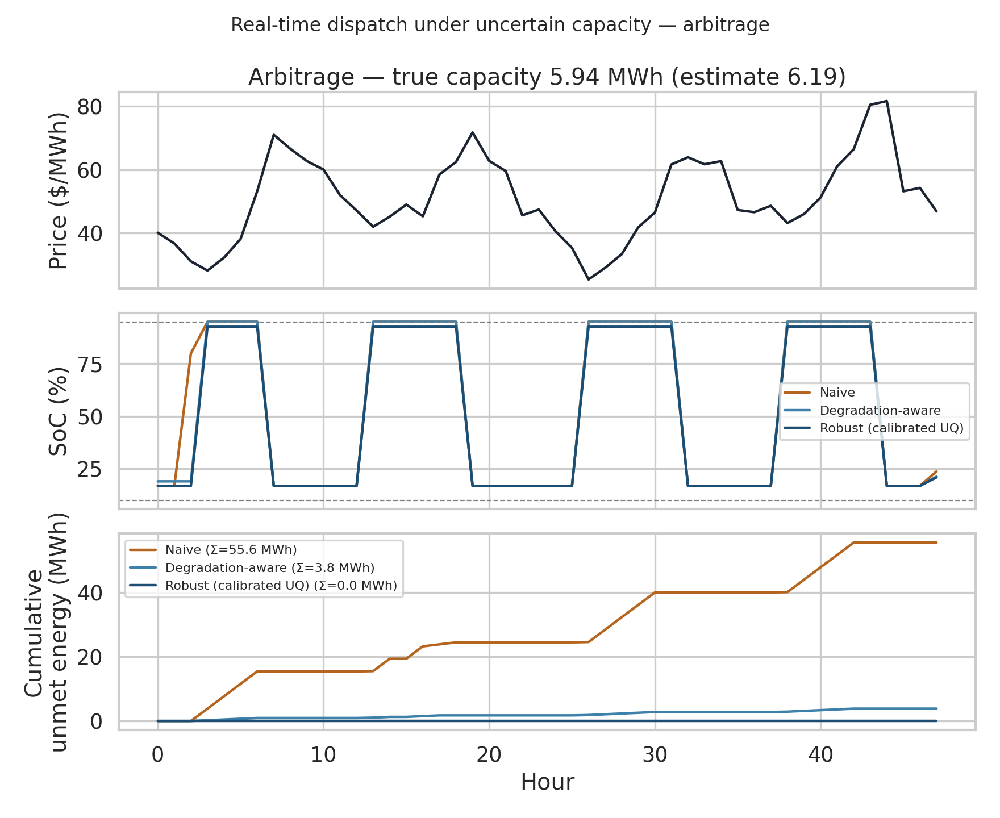
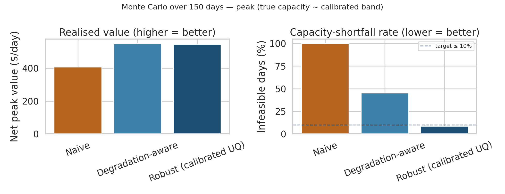
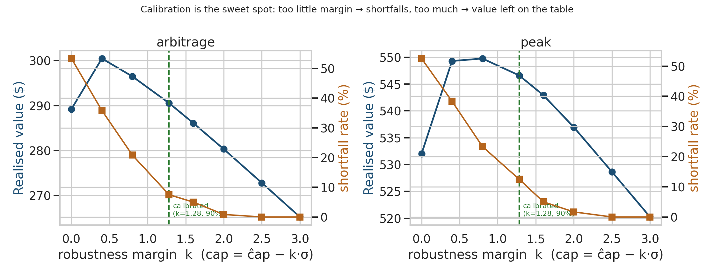

# Grid-scale storage: predictive maintenance **and** real-time optimization


A worked example for the IEEE PES topic *"AI-powered Digital Twins for Grid-Scale
Energy Storage: Enabling Predictive Maintenance and Real-Time Optimization."*

The title names two things. This example shows they are **one pipeline**:

> The calibrated **predictive-maintenance** twin (battery State-of-Health — the
> empirical-end model from [`../battery_soh`](../battery_soh)) gives the **real-time
> optimizer** what a plain optimizer lacks: the *shrinking, uncertain usable
> capacity*, a *degradation cost per unit of throughput*, and — crucially — a
> **calibrated uncertainty band** on the capacity that becomes a robust (chance)
> constraint. Calibrated uncertainty is what makes the optimization trustworthy.

## The setup

A grid-scale battery (10 MWh nominal, 5 MW) runs a **receding-horizon (MPC)**
dispatch over two real-time objectives:

- **Peak shaving** — cut the peak of net grid demand (priced via a demand charge).
- **Energy arbitrage** — charge when price is low, discharge when high.

The true usable capacity has degraded and is only known through the SoH twin as a
point estimate `ĉap` with a calibrated band `σ`. Three dispatch strategies:

| Strategy | Capacity it assumes | Degradation cost |
|---|---|---|
| **Naive** | nominal (10 MWh) | ignored |
| **Degradation-aware** | point estimate `ĉap` | included |
| **Robust (calibrated UQ)** | lower band `ĉap − z·σ` (90%) | included |

Only the **usable ceiling** carries the uncertainty; the reserve floor is fixed.
Each strategy plans with its assumed capacity, then dispatch is **realised under
the true capacity** — so over-promising shows up as unmet (undeliverable) energy.

## What the results show

Monte Carlo over 150 days (true capacity drawn from the calibrated band):

| Strategy | Arbitrage value ($/day) | Shortfall days | Peak value ($/day) | Shortfall days |
|---|---|---|---|---|
| Naive | 194 | **100%** | 408 | **100%** |
| Degradation-aware | 304 | 49% | 551 | 45% |
| Robust (calibrated UQ) | 291 | **9%** | 546 | **9%** |

- **Naive** assumes nominal capacity → over-promises **every** day.
- **Degradation-aware (point)** is a coin-flip: the true capacity sits below the
  point estimate roughly half the time.
- **Robust (calibrated UQ)** hits the **9% shortfall** target (≈ the 10% the 90%
  band promises) while giving up only ~4% of value. **The calibration does real
  work** — it is the knob that turns "trust" into a feasible, near-optimal plan.

The **calibration sweet spot** (`05_calibration_sweet_spot.png`): sweeping the
robustness margin `k` (cap = `ĉap − k·σ`), the realised value peaks near the
calibrated margin and then falls — too little margin causes shortfalls, too much
leaves value on the table. At the calibrated `k ≈ 1.28`, empirical coverage is
**90%**, matching the nominal band.

## Figures

**Real-time dispatch under uncertain capacity (arbitrage).** Price, state-of-charge,
and cumulative *unmet* energy per strategy — the naive plan leaves ~56 MWh
undeliverable, the calibrated-robust plan leaves 0.



**Monte Carlo over 150 days.** Realised value vs capacity-shortfall rate. The
robust (calibrated-UQ) dispatch meets the ≤10% feasibility target at near-maximal
value; the naive plan over-promises every single day.




**Calibration is the sweet spot.** Sweeping the robustness margin `k`, realised
value peaks near the calibrated margin (`k ≈ 1.28`, 90% coverage); too little
margin causes shortfalls, too much leaves value on the table.



Per-figure data is exported to `figure_data/*.csv`.

## Minimal example

```python
import numpy as np
from run_dispatch import capacity_belief, plan_horizon, daily_price, C_DEG

price = daily_price(1, seed=11)           # 24 h day-ahead price
cap_hat, sigma = capacity_belief(800)     # SoH twin: usable capacity + calibrated band
z = 1.2816                                # one-sided 90%

# Robust dispatch uses the calibrated *lower* capacity band:
plan = plan_horizon("arbitrage", e0=3.0,
                    cap_assumed=cap_hat - z * sigma,
                    signal_H=price, c_deg=C_DEG)
print(f"hour-0 action: charge {plan['pc0']:.2f} MW / discharge {plan['pd0']:.2f} MW")
```

## Run

```bash
pip install cvxpy pandas matplotlib seaborn   # plus numpy
python run_dispatch.py
```

Runs on a laptop CPU in seconds (parameterised cvxpy problems, CLARABEL solver).

By default the script uses clearly-diurnal **synthetic** signals. To run on real
public EU data, see below — the script auto-detects it.

## Reproduce on real EU data (OPSD / ENTSO-E)

The example reads real day-ahead prices and demand from
[Open Power System Data](https://data.open-power-system-data.org/time_series/)
(ENTSO-E origin, CC-BY 4.0) if present — no code changes needed.

```bash
# 1. Download the 60-minute time series (one file) and put it in data/:
#    https://data.open-power-system-data.org/time_series/2020-10-06/time_series_60min_singleindex.csv
#    -> examples/grid_storage_dispatch/data/time_series_60min_singleindex.csv

# 2. Slice it to one country/window (default Spain, 90 days):
python prepare_opsd.py            # or:  python prepare_opsd.py DE_LU 90

# 3. Re-run — it now reports "data source: OPSD/ENTSO-E (real)":
python run_dispatch.py
```

`prepare_opsd.py` writes `data/eu_market.csv` (`timestamp, price_eur_mwh,
load_mw`). The national demand series is used as a **shape** and rescaled per day
to a `SITE_PEAK ≈ 9 MW` site so the 10 MWh / 5 MW battery is meaningful; real
day-ahead prices are used directly for arbitrage. The `data/` folder is
git-ignored (downloaded locally, not committed).

## Scope and caveats

- The default signals are **synthetic** (clearly diurnal) for legibility; real
  EU public data (OPSD/ENTSO-E) drops in via `prepare_opsd.py` (see above).
- The degradation cost and capacity band are illustrative parameterisations of
  the empirical SoH model; the point is the **pipeline** (PM → calibrated UQ →
  RTO), not these specific constants.
- This is a single-asset dispatch; multi-asset / network-coupled dispatch is a
  natural extension via port composition.
