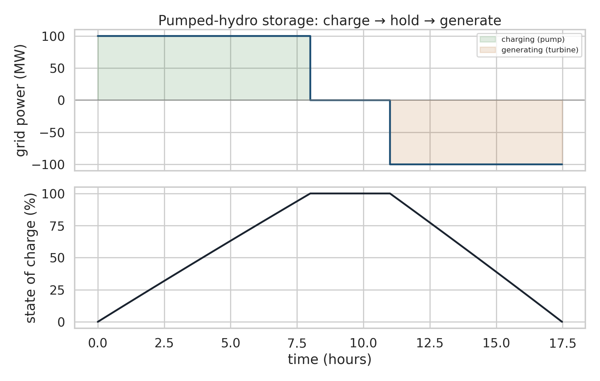
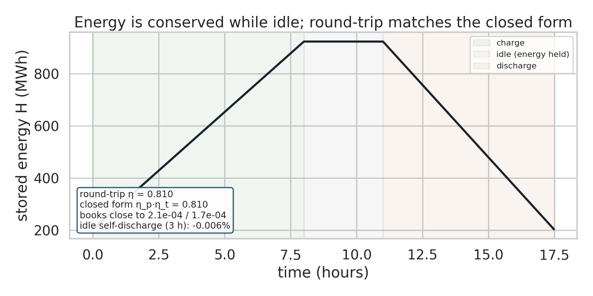

# Pumped-hydro storage — first-principles model (white-box, grid-scale)

A **white-box** digital twin of the dominant grid-scale storage technology.
Pumped hydro is ~95% of the world's installed long-duration storage (~200 GW);
it stores energy as the gravitational potential energy of water lifted between
two reservoirs, moved by a reversible pump-turbine.

This is the counterpart to the battery State-of-Health example, and the contrast
is the point: **the storage medium decides the model class.** Electrochemical
aging (SoH) has no closed-form law, so it is grey-box. Mechanical/hydraulic
storage has an *exact* first-principles energy, so the twin is white-box and can
be validated against closed-form answers — energy conservation and round-trip
efficiency — with no fitting.

State `x = [V_u, V_l]` (reservoir volumes), input `u = [q]` (pump-turbine flow;
`q > 0` charges, `q < 0` generates), energy

```
H = ρ g [ z_u V_u + V_u²/(2 A_u) + V_l²/(2 A_l) ]   (gravitational PE)
```

Structure: `J = 0` (no lossless circulation), `R = (1/R_penstock)·[[1,−1],[−1,1]]`
(penstock conductance, PSD — with the valve open and the pump off, water runs
downhill and the head difference is dissipated), `g = [[1],[−1]]` (the
pump-turbine moves water between reservoirs). Unlike the water tank, whose open
drain dissipates energy, the connection here is a *controlled, reversible* power
port, so the store is conservative.



Charge on cheap/surplus power (pump up), hold, then generate on demand — the
state of charge is the upper reservoir level.



The stored energy `H(t)` rises on charge, stays flat while idle (conserved), and
falls on discharge.

## What it demonstrates

- **First-principles energy, exactly conserved.** While idle the stored energy is
  constant to within ~0.006% over 3 hours (a perfect store as the valve seals) —
  the white-box guarantee a degradation model cannot offer.
- **Validation against a closed form.** The simulated round-trip efficiency
  (≈ **0.810**) matches the closed form `η_pump · η_turbine` to within 0.05%, and
  the energy books close to ~1e-4: stored energy `= η_pump ×` electrical-in on
  charge; electrical-out `= η_turbine ×` stored energy on discharge.
- **Passivity.** With the penstock valve open and the pump off, water runs
  downhill and the stored energy is monotonically non-increasing (`dH/dt ≤ 0`).
- **Grid scale.** The example plant (300 m head, 5 ha upper reservoir) cycles
  ≈ 720 MWh per charge — a real grid-storage asset, with a real 70–85% round-trip
  efficiency.

## Why this is white-box (and the battery is not)

The model is written entirely from physics with parameters from the plant's
geometry (areas, head) and known conversion efficiencies — nothing is fitted to
data, and the result is checked against an analytic answer. Battery capacity fade
has no such closed form: its degradation parameters must be estimated and there is
no analytic trajectory to validate against (see `../battery_soh`). Same otwin
workflow, opposite ends of the white-box ↔ grey-box continuum.

## Run

```bash
pip install numpy scipy matplotlib seaborn
python run_pumped_hydro.py
```

Runs in a second or two on CPU. Figures are written to `figures/`, the underlying
series and validation numbers to `figure_data/`.
